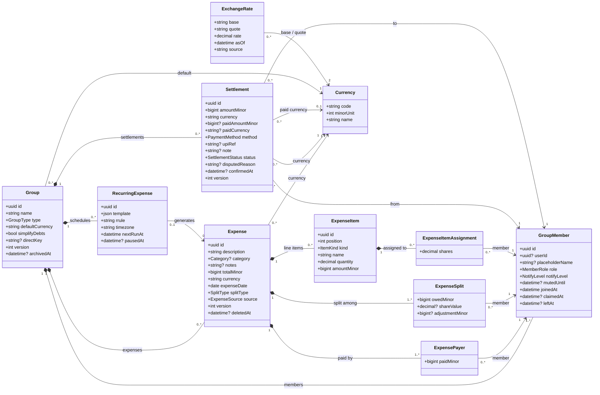
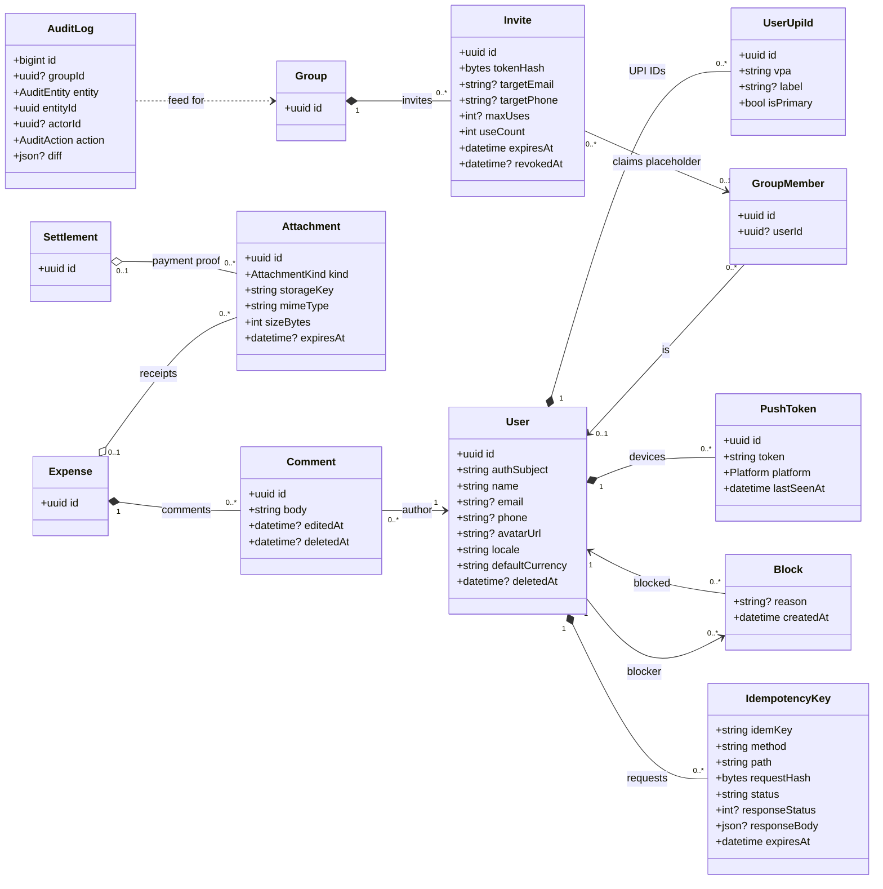
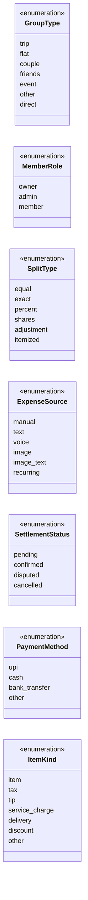
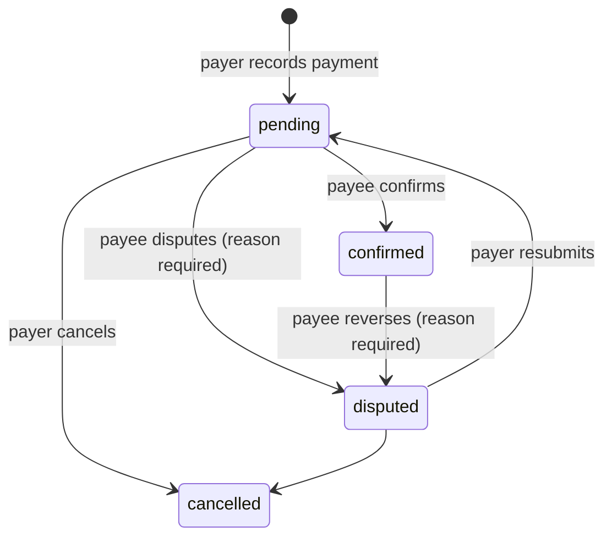

# SpeakSplit Pay: Data Model & PostgreSQL Schema

Companion to [`plan.md`](plan.md). Covers the entity class diagrams, full PostgreSQL DDL with constraints, indexes, balance views, an optional row-level security setup, and notes on mapping all of it to TypeORM.

Implemented in `apps/api/src/database/migrations/1791331200000-InitialSchema.ts`. Section 3 is generated from that file, so the two always match.

> **Target:** PostgreSQL 16+. The DDL is exercised by the integration tests in `apps/api/test` (`pnpm test:int`, see [section 9](#9-verification)).

---

## Table of contents

1. [Design decisions](#1-design-decisions)
2. [Class diagrams](#2-class-diagrams)
3. [DDL](#3-ddl)
4. [Index catalogue](#4-index-catalogue)
5. [Common queries and the indexes they use](#5-common-queries-and-the-indexes-they-use)
6. [Optional: row-level security](#6-optional-row-level-security)
7. [TypeORM mapping notes](#7-typeorm-mapping-notes)
8. [Data lifecycle and maintenance](#8-data-lifecycle-and-maintenance)
9. [Verification](#9-verification)

---

## 1. Design decisions

Items marked **(change)** differ from the plan's first draft; section 6 of `plan.md` has been updated to match.

| # | Decision | Why |
|---|---|---|
| 1 | **(change)** `users.id` is an internal UUID; the Auth0 `sub` lives in `users.auth_subject` (unique). | Foreign keys stay compact UUIDs, and switching or adding an identity provider later doesn't rewrite every table. |
| 2 | **(change)** Payers, splits, item assignments and settlements reference **`group_members.id`**, not `users.id`. | Placeholder members (FR-30) have no user account but still owe and pay money. When a placeholder is claimed, `user_id` is filled in and all history follows automatically. |
| 3 | **(change)** Friend-to-friend expenses (FR-23) live in a hidden group with `type = 'direct'`, so `expenses.group_id` is always `NOT NULL`. `direct_key` (the two user IDs, sorted) keeps one direct group per pair. | One code path for balances, settlements and feeds instead of two. |
| 4 | Composite foreign keys such as `(group_id, member_id) → group_members (group_id, id)`. | The database itself guarantees that every payer, split and settlement belongs to the **same group** as its expense. A cross-group mix-up is impossible, not just unlikely. |
| 5 | `expense_splits` always stores the **final** owed amount in minor units, whatever the split type. `split_type`, `share_value`, `adjustment_minor` and item assignments record the user's input. | Balances are a plain `SUM`, and the split engine's output is what's stored and audited. |
| 6 | A **deferred constraint trigger** checks at commit that payers and splits each sum exactly to `total_minor`. | The core money invariant is enforced by Postgres, not only by application code. The check runs at `COMMIT`, so an expense and its rows can be inserted in any order within one transaction. |
| 7 | **(change)** UPI IDs move to `user_upi_ids` (several per user, at most one primary). | FR-50 allows multiple UPI IDs. |
| 8 | **(change)** `expense_items.assigned_user_ids` (array) becomes the join table `expense_item_assignments`. | Arrays can't have foreign keys; a join table can, and it supports weighted shares per item. |
| 9 | Enumerations are `text` columns with `CHECK` constraints, not Postgres `ENUM` types. | Adding a value is a one-line constraint change. Removing or renaming an `ENUM` value is awkward, and TypeORM's enum migrations are fiddly. |
| 10 | **(change)** Money is a `bigint` count of the currency's **minor unit** (paise, cents, yen, fils), in columns named `*_minor`. | Integers are exact to the smallest unit of every currency. `integer` would overflow at about Rp 21 million (IDR has 2 decimals), so amounts are `bigint`; the API maps them to JS numbers with a transformer that refuses anything beyond `Number.MAX_SAFE_INTEGER` (about ₹90 trillion). |
| 11 | Soft deletes for expenses and comments (`deleted_at`). Members leave via `left_at` and are never hard-deleted on their own; only deleting a whole group removes member rows. Users are anonymised, not deleted. | History and balances stay correct for everyone else in the group. |
| 12 | `audit_log` is append-only, carries `group_id`, and also serves as the activity feed (FR-37). It has no foreign keys. | The trail survives deletions and can't be edited after the fact. |
| 13 | `version` columns on `groups`, `expenses` and `settlements`. | Optimistic locking via TypeORM `@VersionColumn`, so two people editing the same expense can't silently overwrite each other. |
| 14 | A generic `idempotency_keys` table. | Used by a NestJS interceptor for create-expense and record-payment, so retries on bad networks never duplicate anything. |
| 15 | **(change)** A `currencies` reference table (code, minor-unit exponent), seeded from the split engine's list; every currency column is a foreign key to it. | Unknown currencies are impossible, and the number of decimals per currency is data, not code scattered across clients. An integration test checks the seed matches the split engine. |
| 16 | **(change)** Each expense and settlement has its own `currency`; groups and users have a `default_currency`. | Trips abroad mix currencies within one group. |
| 17 | **(change)** Balances are per currency. `member_balances` returns one row per (member, currency); amounts in different currencies are never added together. | Converting at today's rate would silently change what people owe. Conversion is a display concern, and settling is an explicit act. |
| 18 | **(change)** A settlement stores the debt cleared (`amount_minor` + `currency`) and, if paid in another currency, what was actually sent (`paid_amount_minor` + `paid_currency`). UPI requires INR. | Paying a $10 debt with ₹831.23 over UPI clears exactly $10 and keeps the rupee amount for the record; the implied rate is the payer's choice. |
| 19 | `exchange_rates` holds dated rates (`numeric(24,12)`) used only for converted views and suggested settlement amounts. | Rates can be wrong or stale; nothing that affects balances depends on them. |
| 20 | **(change)** Friends are explicit rows in `friendships` (one per pair, `user_a < user_b`), on top of the implicit "shares a group" relationship. | Lets people split without creating a group first, and keeps a friendship when nobody shares a group. |
| 21 | `friend_requests` can target a user, an email or a phone; email and phone requests are matched at read time against the recipient's **verified** email or phone. | Nobody learns whether an address is registered, and a request waits for someone who signs up later with that address. |
| 22 | `invites.kind` is `group` or `friend`; friend invites have no group. | One token, expiry and use-limit mechanism for both kinds of link. |

---

## 2. Class diagrams

Notation: `?` marks a nullable field. Amounts are `bigint` minor units of the row's currency.

### 2.1 Core ledger



### 2.2 Identity, access and supporting entities



### 2.3 Enumerations



Smaller enumerations (`NotifyLevel`, `Category`, `AttachmentKind`, `Platform`, `AuditEntity`, `AuditAction`) are listed in the `CHECK` constraints in section 3.

**Settlement status transitions** (enforced in the service layer; the table enforces the field combinations). Decided for the MVP: a recorded payment is created directly as `confirmed`, with `confirmed_by` set to the person who recorded it, so it counts at once; `pending` is unused until payee confirmation is wanted. The API also rejects partial payments: `amount_minor` must equal what the payer owes the payee in that currency.



---

## 3. DDL

Run in order. In the repository this is the first hand-written TypeORM migration (see [section 7](#7-typeorm-mapping-notes)); this section is generated from it.

### 3.1 Extensions and helpers

```sql
create extension if not exists pg_trgm;   -- fuzzy / substring search
create extension if not exists citext;    -- case-insensitive email

create or replace function set_updated_at() returns trigger
language plpgsql as $$
begin
  new.updated_at := now();
  return new;
end $$;

create or replace function forbid_mutation() returns trigger
language plpgsql as $$
begin
  raise exception '% is append-only', tg_table_name
    using errcode = 'insufficient_privilege';
end $$;
```

### 3.2 `currencies`

_ISO 4217 codes and their minor-unit exponent, seeded from the split engine._

```sql
-- Keep in sync with CURRENCIES in packages/split-engine/src/currency.ts.
create table currencies (
  code        char(3)  primary key,
  minor_unit  smallint not null,
  name        text     not null,

  constraint currencies_code_ck       check (code ~ '^[A-Z]{3}$'),
  constraint currencies_minor_unit_ck check (minor_unit between 0 and 4)
);

insert into currencies (code, minor_unit, name) values
  ('AED', 2, 'UAE Dirham'),
  ('AUD', 2, 'Australian Dollar'),
  ('BDT', 2, 'Bangladeshi Taka'),
  ('BHD', 3, 'Bahraini Dinar'),
  ('BTN', 2, 'Bhutanese Ngultrum'),
  ('CAD', 2, 'Canadian Dollar'),
  ('CHF', 2, 'Swiss Franc'),
  ('CNY', 2, 'Chinese Yuan'),
  ('EUR', 2, 'Euro'),
  ('GBP', 2, 'Pound Sterling'),
  ('HKD', 2, 'Hong Kong Dollar'),
  ('IDR', 2, 'Indonesian Rupiah'),
  ('INR', 2, 'Indian Rupee'),
  ('JPY', 0, 'Japanese Yen'),
  ('KRW', 0, 'South Korean Won'),
  ('KWD', 3, 'Kuwaiti Dinar'),
  ('LKR', 2, 'Sri Lankan Rupee'),
  ('MVR', 2, 'Maldivian Rufiyaa'),
  ('MYR', 2, 'Malaysian Ringgit'),
  ('NPR', 2, 'Nepalese Rupee'),
  ('NZD', 2, 'New Zealand Dollar'),
  ('OMR', 3, 'Omani Rial'),
  ('PHP', 2, 'Philippine Peso'),
  ('QAR', 2, 'Qatari Riyal'),
  ('SAR', 2, 'Saudi Riyal'),
  ('SGD', 2, 'Singapore Dollar'),
  ('THB', 2, 'Thai Baht'),
  ('USD', 2, 'US Dollar'),
  ('VND', 0, 'Vietnamese Dong'),
  ('ZAR', 2, 'South African Rand');
```

### 3.3 `exchange_rates`

_Dated rates for converted views and settlement suggestions. Balances never use them._

```sql
-- Balances themselves are never converted.
create table exchange_rates (
  base        char(3)        not null references currencies (code),
  quote       char(3)        not null references currencies (code),
  rate        numeric(24,12) not null,                   -- units of quote per one unit of base
  as_of       timestamptz    not null,
  source      text           not null,
  created_at  timestamptz    not null default now(),

  constraint exchange_rates_pk          primary key (base, quote, as_of),
  constraint exchange_rates_distinct_ck check (base <> quote),
  constraint exchange_rates_rate_ck     check (rate > 0)
);
```

### 3.4 `users`

```sql
create table users (
  id                uuid        primary key default gen_random_uuid(),
  auth_subject      text        not null,                 -- Auth0 'sub' claim
  name              text        not null,
  email             citext,
  phone             text,                                  -- E.164
  avatar_url        text,
  locale            text        not null default 'en-IN',
  default_currency  char(3)     not null default 'INR' references currencies (code),
  created_at        timestamptz not null default now(),
  updated_at        timestamptz not null default now(),
  deleted_at        timestamptz,

  constraint users_auth_subject_uq unique (auth_subject),
  constraint users_name_len_ck     check (char_length(btrim(name)) between 1 and 80),
  constraint users_email_ck        check (email is null or email ~ '^[^@\s]+@[^@\s]+\.[^@\s]+$'),
  constraint users_phone_e164_ck   check (phone is null or phone ~ '^\+[1-9][0-9]{7,14}$'),
  constraint users_avatar_https_ck check (avatar_url is null or avatar_url ~ '^https://'),
  constraint users_locale_ck       check (locale ~ '^[a-z]{2}(-[A-Z]{2})?$')
);

create unique index users_email_active_uq on users (email) where email is not null and deleted_at is null;
create unique index users_phone_active_uq on users (phone) where phone is not null and deleted_at is null;

create trigger users_set_updated_at before update on users
  for each row execute function set_updated_at();
```

### 3.5 `user_upi_ids`

```sql
create table user_upi_ids (
  id          uuid        primary key default gen_random_uuid(),
  user_id     uuid        not null references users (id) on delete cascade,
  vpa         text        not null,                        -- e.g. name@okaxis
  label       text,
  is_primary  boolean     not null default false,
  created_at  timestamptz not null default now(),

  constraint user_upi_ids_vpa_ck   check (vpa ~ '^[A-Za-z0-9._-]{2,64}@[A-Za-z][A-Za-z0-9.-]{1,63}$'),
  constraint user_upi_ids_label_ck check (label is null or char_length(label) <= 40)
);

create unique index user_upi_ids_user_vpa_uq     on user_upi_ids (user_id, lower(vpa));
create unique index user_upi_ids_one_primary_uq  on user_upi_ids (user_id) where is_primary;
```

### 3.6 `groups`

```sql
create table groups (
  id               uuid        primary key default gen_random_uuid(),
  name             text        not null,
  type             text        not null default 'friends',
  default_currency char(3)     not null default 'INR' references currencies (code),
  simplify_debts   boolean     not null default true,
  direct_key       text,                                    -- '<uuidA>:<uuidB>' sorted, only for type='direct'
  created_by       uuid        not null references users (id),
  version          integer     not null default 1,          -- optimistic locking
  created_at       timestamptz not null default now(),
  updated_at       timestamptz not null default now(),
  archived_at      timestamptz,

  constraint groups_name_len_ck   check (char_length(btrim(name)) between 1 and 100),
  constraint groups_type_ck       check (type in ('trip','flat','couple','friends','event','other','direct')),
  constraint groups_direct_key_ck check ((type = 'direct') = (direct_key is not null)),
  constraint groups_direct_key_uq unique (direct_key)
);

create index groups_created_by_idx on groups (created_by);

create trigger groups_set_updated_at before update on groups
  for each row execute function set_updated_at();
```

### 3.7 `group_members`

_Real users and placeholders._

```sql
create table group_members (
  id                uuid        primary key default gen_random_uuid(),
  group_id          uuid        not null references groups (id) on delete cascade,
  user_id           uuid        references users (id),     -- null = placeholder
  placeholder_name  text,
  role              text        not null default 'member',
  notify_level      text        not null default 'all',
  muted_until       timestamptz,
  invited_by        uuid        references users (id),
  removed_by        uuid        references users (id),
  joined_at         timestamptz not null default now(),
  claimed_at        timestamptz,
  left_at           timestamptz,

  constraint group_members_group_id_id_uq     unique (group_id, id),       -- target for composite FKs
  constraint group_members_group_user_uq      unique (group_id, user_id),
  constraint group_members_identity_ck        check (user_id is not null or placeholder_name is not null),
  constraint group_members_placeholder_len_ck check (placeholder_name is null or char_length(btrim(placeholder_name)) between 1 and 80),
  constraint group_members_role_ck            check (role in ('owner','admin','member')),
  constraint group_members_owner_is_user_ck   check (role <> 'owner' or user_id is not null),
  constraint group_members_notify_ck          check (notify_level in ('all','important','none')),
  constraint group_members_left_ck            check (left_at is null or left_at >= joined_at),
  constraint group_members_claimed_ck         check (claimed_at is null or (user_id is not null and placeholder_name is not null)),
  constraint group_members_removed_ck         check (removed_by is null or left_at is not null)
);

create unique index group_members_one_owner_uq        on group_members (group_id) where role = 'owner' and left_at is null;
create unique index group_members_placeholder_name_uq on group_members (group_id, lower(placeholder_name)) where user_id is null;
create index        group_members_user_active_idx     on group_members (user_id) where user_id is not null and left_at is null;

-- Members are never hard-deleted on their own (they leave via left_at).
-- The only allowed path is a cascade from deleting the whole group.
create or replace function guard_member_hard_delete() returns trigger
language plpgsql as $$
begin
  if exists (select 1 from groups where id = old.group_id) then
    raise exception 'group_members are not hard-deleted; set left_at instead'
      using errcode = 'restrict_violation';
  end if;
  return old;
end $$;

create trigger group_members_no_hard_delete before delete on group_members
  for each row execute function guard_member_hard_delete();
```

### 3.8 `recurring_expenses` (P2)

_Created before expenses for the FK._

```sql
create table recurring_expenses (
  id           uuid        primary key default gen_random_uuid(),
  group_id     uuid        not null references groups (id) on delete cascade,
  created_by   uuid        not null references users (id),
  template     jsonb       not null,                        -- description, total, payers, splits
  rrule        text        not null,                        -- RFC 5545, e.g. FREQ=MONTHLY;BYMONTHDAY=1
  timezone     text        not null default 'Asia/Kolkata',
  next_run_at  timestamptz not null,
  last_run_at  timestamptz,
  paused_at    timestamptz,
  created_at   timestamptz not null default now(),
  updated_at   timestamptz not null default now(),

  constraint recurring_template_ck check (jsonb_typeof(template) = 'object'),
  constraint recurring_rrule_ck    check (rrule like 'FREQ=%')
);

create index recurring_expenses_due_idx   on recurring_expenses (next_run_at) where paused_at is null;
create index recurring_expenses_group_idx on recurring_expenses (group_id);

create trigger recurring_expenses_set_updated_at before update on recurring_expenses
  for each row execute function set_updated_at();
```

### 3.9 `expenses`

```sql
create table expenses (
  id                    uuid        primary key default gen_random_uuid(),
  group_id              uuid        not null references groups (id) on delete cascade,
  description           text        not null,
  category              text,
  notes                 text,
  total_minor           bigint      not null,
  currency              char(3)     not null references currencies (code),
  expense_date          date        not null default current_date,
  split_type            text        not null,
  source                text        not null default 'manual',
  recurring_expense_id  uuid        references recurring_expenses (id) on delete set null,
  created_by            uuid        not null references users (id),
  updated_by            uuid        references users (id),
  deleted_by            uuid        references users (id),
  version               integer     not null default 1,
  created_at            timestamptz not null default now(),
  updated_at            timestamptz not null default now(),
  deleted_at            timestamptz,

  constraint expenses_id_group_uq        unique (id, group_id),               -- target for composite FKs
  constraint expenses_description_len_ck check (char_length(btrim(description)) between 1 and 200),
  constraint expenses_notes_len_ck       check (notes is null or char_length(notes) <= 2000),
  constraint expenses_total_ck           check (total_minor > 0),
  constraint expenses_date_ck            check (expense_date >= date '2000-01-01'),
  constraint expenses_split_type_ck      check (split_type in ('equal','exact','percent','shares','adjustment','itemized')),
  constraint expenses_source_ck          check (source in ('manual','text','voice','image','image_text','recurring')),
  constraint expenses_category_ck        check (category is null or category in
                                           ('food','groceries','travel','transport','stay','rent','utilities',
                                            'household','staff','entertainment','shopping','health','other')),
  constraint expenses_deleted_ck         check ((deleted_at is null) = (deleted_by is null)),
  constraint expenses_recurring_src_ck   check (recurring_expense_id is null or source = 'recurring')
);

create index expenses_group_date_idx       on expenses (group_id, expense_date desc, created_at desc) where deleted_at is null;
create index expenses_group_category_idx   on expenses (group_id, category) where deleted_at is null and category is not null;
create index expenses_description_trgm_idx on expenses using gin (description gin_trgm_ops) where deleted_at is null;
create index expenses_created_by_idx       on expenses (created_by);
create index expenses_recurring_idx        on expenses (recurring_expense_id) where recurring_expense_id is not null;

create trigger expenses_set_updated_at before update on expenses
  for each row execute function set_updated_at();
```

### 3.10 `expense_payers`

```sql
create table expense_payers (
  expense_id  uuid    not null,
  group_id    uuid    not null,
  member_id   uuid    not null,
  paid_minor  bigint  not null,

  constraint expense_payers_pk         primary key (expense_id, member_id),
  constraint expense_payers_expense_fk foreign key (expense_id, group_id)
                                       references expenses (id, group_id) on delete cascade,
  constraint expense_payers_member_fk  foreign key (group_id, member_id)
                                       references group_members (group_id, id) on delete cascade,
  constraint expense_payers_amount_ck  check (paid_minor > 0)
);

create index expense_payers_member_idx on expense_payers (group_id, member_id);
```

### 3.11 `expense_splits`

_Always the materialised result, whatever the split type._

```sql
create table expense_splits (
  expense_id        uuid          not null,
  group_id          uuid          not null,
  member_id         uuid          not null,
  owed_minor        bigint        not null,
  share_value       numeric(12,4),           -- input: percent or share units
  adjustment_minor  bigint,                  -- input: +/- for adjustment splits

  constraint expense_splits_pk         primary key (expense_id, member_id),
  constraint expense_splits_expense_fk foreign key (expense_id, group_id)
                                       references expenses (id, group_id) on delete cascade,
  constraint expense_splits_member_fk  foreign key (group_id, member_id)
                                       references group_members (group_id, id) on delete cascade,
  constraint expense_splits_owed_ck    check (owed_minor >= 0),
  constraint expense_splits_share_ck   check (share_value is null or share_value >= 0)
);

create index expense_splits_member_idx on expense_splits (group_id, member_id);
```

### 3.12 `expense_items` + `expense_item_assignments`

_Itemised receipts, FR-7._

```sql
create table expense_items (
  id            uuid          primary key default gen_random_uuid(),
  expense_id    uuid          not null,
  group_id      uuid          not null,
  position      smallint      not null,
  kind          text          not null default 'item',
  name          text          not null,
  quantity      numeric(10,3) not null default 1,
  amount_minor  bigint        not null,     -- line total; discounts are positive and subtracted by kind

  constraint expense_items_id_group_uq   unique (id, group_id),
  constraint expense_items_position_uq   unique (expense_id, position),
  constraint expense_items_expense_fk    foreign key (expense_id, group_id)
                                         references expenses (id, group_id) on delete cascade,
  constraint expense_items_kind_ck       check (kind in ('item','tax','tip','service_charge','delivery','discount','other')),
  constraint expense_items_name_len_ck   check (char_length(btrim(name)) between 1 and 120),
  constraint expense_items_quantity_ck   check (quantity > 0),
  constraint expense_items_amount_ck     check (amount_minor >= 0),
  constraint expense_items_position_ck   check (position >= 0)
);

create table expense_item_assignments (
  item_id    uuid          not null,
  group_id   uuid          not null,
  member_id  uuid          not null,
  shares     numeric(10,4) not null default 1,

  constraint expense_item_assignments_pk        primary key (item_id, member_id),
  constraint expense_item_assignments_item_fk   foreign key (item_id, group_id)
                                                references expense_items (id, group_id) on delete cascade,
  constraint expense_item_assignments_member_fk foreign key (group_id, member_id)
                                                references group_members (group_id, id) on delete cascade,
  constraint expense_item_assignments_shares_ck check (shares > 0)
);

create index expense_item_assignments_member_idx on expense_item_assignments (group_id, member_id);
```

### 3.13 `settlements`

_`amount_minor` + `currency` is the debt cleared; `paid_amount_minor` + `paid_currency` is what was actually sent, when that was another currency (FR-61)._

```sql
create table settlements (
  id                 uuid        primary key default gen_random_uuid(),
  group_id           uuid        not null references groups (id) on delete cascade,
  from_member_id     uuid        not null,
  to_member_id       uuid        not null,
  amount_minor       bigint      not null,                -- debt cleared, in currency
  currency           char(3)     not null references currencies (code),
  paid_amount_minor  bigint,                               -- what was actually sent, if in another currency
  paid_currency      char(3)     references currencies (code),
  method             text        not null default 'upi',
  upi_ref            text,
  note               text,
  status             text        not null default 'pending',
  disputed_reason    text,
  created_by         uuid        not null references users (id),
  confirmed_by       uuid        references users (id),
  confirmed_at       timestamptz,
  version            integer     not null default 1,
  created_at         timestamptz not null default now(),
  updated_at         timestamptz not null default now(),

  constraint settlements_from_fk         foreign key (group_id, from_member_id) references group_members (group_id, id) on delete cascade,
  constraint settlements_to_fk           foreign key (group_id, to_member_id)   references group_members (group_id, id) on delete cascade,
  constraint settlements_distinct_ck     check (from_member_id <> to_member_id),
  constraint settlements_amount_ck       check (amount_minor > 0),
  constraint settlements_paid_ck         check ((paid_currency is null) = (paid_amount_minor is null)),
  constraint settlements_paid_amount_ck  check (paid_amount_minor is null or paid_amount_minor > 0),
  constraint settlements_paid_curr_ck    check (paid_currency is null or paid_currency <> currency),
  constraint settlements_upi_inr_ck      check (method <> 'upi' or coalesce(paid_currency, currency) = 'INR'),
  constraint settlements_method_ck       check (method in ('upi','cash','bank_transfer','other')),
  constraint settlements_status_ck       check (status in ('pending','confirmed','disputed','cancelled')),
  constraint settlements_upi_ref_ck      check (upi_ref is null or upi_ref ~ '^[A-Za-z0-9]{6,35}$'),
  constraint settlements_upi_ref_meth_ck check (upi_ref is null or method = 'upi'),
  constraint settlements_confirmed_ck    check ((status = 'confirmed') = (confirmed_at is not null)),
  constraint settlements_confirmer_ck    check (confirmed_at is null or confirmed_by is not null),
  constraint settlements_dispute_ck      check (status <> 'disputed' or disputed_reason is not null),
  constraint settlements_note_len_ck     check (note is null or char_length(note) <= 500)
);

create index settlements_group_created_idx on settlements (group_id, created_at desc);
create index settlements_from_idx          on settlements (group_id, from_member_id);
create index settlements_to_idx            on settlements (group_id, to_member_id);
create unique index settlements_upi_ref_uq on settlements (group_id, upi_ref)
  where upi_ref is not null and status <> 'cancelled';

create trigger settlements_set_updated_at before update on settlements
  for each row execute function set_updated_at();
```

### 3.14 `invites`

```sql
create table invites (
  id                     uuid        primary key default gen_random_uuid(),
  group_id               uuid        not null references groups (id) on delete cascade,
  token_hash             bytea       not null,               -- sha256(token); raw token only in the link
  target_email           citext,
  target_phone           text,
  placeholder_member_id  uuid,                               -- invite to claim a placeholder
  created_by             uuid        not null references users (id),
  max_uses               integer,
  use_count              integer     not null default 0,
  expires_at             timestamptz not null,
  revoked_at             timestamptz,
  created_at             timestamptz not null default now(),

  constraint invites_token_hash_uq   unique (token_hash),
  constraint invites_placeholder_fk  foreign key (group_id, placeholder_member_id)
                                     references group_members (group_id, id) on delete cascade,
  constraint invites_token_len_ck    check (octet_length(token_hash) = 32),
  constraint invites_max_uses_ck     check (max_uses is null or max_uses > 0),
  constraint invites_use_count_ck    check (use_count >= 0 and (max_uses is null or use_count <= max_uses)),
  constraint invites_expiry_ck       check (expires_at > created_at),
  constraint invites_placeholder_ck  check (placeholder_member_id is null or max_uses = 1),
  constraint invites_phone_ck        check (target_phone is null or target_phone ~ '^\+[1-9][0-9]{7,14}$')
);

create index invites_group_active_idx on invites (group_id) where revoked_at is null;
```

### 3.15 `blocks`

```sql
create table blocks (
  blocker_id  uuid        not null references users (id) on delete cascade,
  blocked_id  uuid        not null references users (id) on delete cascade,
  reason      text,
  created_at  timestamptz not null default now(),

  constraint blocks_pk         primary key (blocker_id, blocked_id),
  constraint blocks_not_self   check (blocker_id <> blocked_id),
  constraint blocks_reason_ck  check (reason is null or char_length(reason) <= 200)
);

create index blocks_blocked_idx on blocks (blocked_id);
```

### 3.16 `attachments`

_Receipts, payment proofs, parse-only temp uploads._

```sql
create table attachments (
  id             uuid        primary key default gen_random_uuid(),
  uploaded_by    uuid        not null references users (id),
  expense_id     uuid        references expenses (id) on delete cascade,
  settlement_id  uuid        references settlements (id) on delete cascade,
  kind           text        not null,
  storage_key    text        not null,                      -- S3 object key
  mime_type      text        not null,
  size_bytes     integer     not null,
  sha256         bytea,
  width_px       integer,
  height_px      integer,
  expires_at     timestamptz,                               -- set for unattached (parse-only) uploads
  created_at     timestamptz not null default now(),

  constraint attachments_storage_key_uq unique (storage_key),
  constraint attachments_kind_ck        check (kind in ('receipt','payment_proof')),
  constraint attachments_mime_ck        check (mime_type in ('image/jpeg','image/png','image/webp','image/heic','application/pdf')),
  constraint attachments_size_ck        check (size_bytes between 1 and 10485760),     -- 10 MB
  constraint attachments_sha256_ck      check (sha256 is null or octet_length(sha256) = 32),
  constraint attachments_dims_ck        check ((width_px is null or width_px > 0) and (height_px is null or height_px > 0)),
  constraint attachments_one_owner_ck   check (num_nonnulls(expense_id, settlement_id) <= 1),
  constraint attachments_orphan_ttl_ck  check ((expense_id is null and settlement_id is null) = (expires_at is not null)),
  constraint attachments_kind_owner_ck  check ((kind = 'receipt' and settlement_id is null)
                                          or (kind = 'payment_proof' and expense_id is null))
);

create index attachments_expense_idx    on attachments (expense_id)    where expense_id is not null;
create index attachments_settlement_idx on attachments (settlement_id) where settlement_id is not null;
create index attachments_expiry_idx     on attachments (expires_at)    where expires_at is not null;
```

### 3.17 `comments` (P2)

```sql
create table comments (
  id          uuid        primary key default gen_random_uuid(),
  expense_id  uuid        not null references expenses (id) on delete cascade,
  author_id   uuid        not null references users (id),
  body        text        not null,
  created_at  timestamptz not null default now(),
  edited_at   timestamptz,
  deleted_at  timestamptz,

  constraint comments_body_len_ck check (char_length(btrim(body)) between 1 and 2000),
  constraint comments_edited_ck   check (edited_at is null or edited_at >= created_at)
);

create index comments_expense_idx on comments (expense_id, created_at) where deleted_at is null;
create index comments_author_idx  on comments (author_id);
```

### 3.18 `push_tokens`

```sql
create table push_tokens (
  id            uuid        primary key default gen_random_uuid(),
  user_id       uuid        not null references users (id) on delete cascade,
  token         text        not null,
  platform      text        not null,
  device_name   text,
  last_seen_at  timestamptz not null default now(),
  created_at    timestamptz not null default now(),

  constraint push_tokens_token_uq    unique (token),
  constraint push_tokens_platform_ck check (platform in ('ios','android','web')),
  constraint push_tokens_token_ck    check (char_length(token) between 10 and 4096)
);

create index push_tokens_user_idx on push_tokens (user_id);
```

### 3.19 `audit_log`

_Append-only; also powers the activity feed, FR-37._

```sql
create table audit_log (
  id          bigint      generated always as identity primary key,
  group_id    uuid,                         -- no FK on purpose: history outlives deletes
  entity      text        not null,
  entity_id   uuid        not null,
  actor_id    uuid,
  action      text        not null,
  diff        jsonb,                        -- ids and amounts only, no PII
  request_id  text,
  created_at  timestamptz not null default now(),

  constraint audit_log_entity_ck check (entity in ('group','member','expense','settlement','invite','comment')),
  constraint audit_log_action_ck check (action in ('create','update','delete','restore','join','leave','remove',
                                                   'role_change','claim','confirm','dispute','cancel')),
  constraint audit_log_diff_ck   check (diff is null or jsonb_typeof(diff) = 'object')
);

create index audit_log_group_feed_idx  on audit_log (group_id, created_at desc, id desc) where group_id is not null;
create index audit_log_entity_idx      on audit_log (entity, entity_id, created_at desc);
create index audit_log_created_brin    on audit_log using brin (created_at);

create trigger audit_log_append_only before update or delete on audit_log
  for each row execute function forbid_mutation();
```

### 3.20 `idempotency_keys`

```sql
create table idempotency_keys (
  user_id          uuid        not null references users (id) on delete cascade,
  idem_key         text        not null,
  method           text        not null,
  path             text        not null,
  request_hash     bytea       not null,       -- sha256 of the canonical request body
  status           text        not null default 'in_progress',
  response_status  smallint,
  response_body    jsonb,
  created_at       timestamptz not null default now(),
  expires_at       timestamptz not null default now() + interval '24 hours',

  constraint idempotency_keys_pk        primary key (user_id, idem_key),
  constraint idempotency_keys_key_ck    check (char_length(idem_key) between 8 and 128),
  constraint idempotency_keys_method_ck check (method in ('POST','PUT','PATCH','DELETE')),
  constraint idempotency_keys_status_ck check (status in ('in_progress','completed')),
  constraint idempotency_keys_resp_ck   check ((status = 'completed') = (response_status is not null)),
  constraint idempotency_keys_hash_ck   check (octet_length(request_hash) = 32)
);

create index idempotency_keys_expires_idx on idempotency_keys (expires_at);
```

### 3.21 Deferred invariant: payers and splits must each sum to the total

```sql
create or replace function check_expense_balanced() returns trigger
language plpgsql as $$
declare
  r          record;
  v_id       uuid;
  v_total    bigint;
  v_deleted  timestamptz;
  v_paid     numeric;
  v_owed     numeric;
begin
  if tg_op = 'DELETE' then r := old; else r := new; end if;
  if tg_table_name = 'expenses' then v_id := r.id; else v_id := r.expense_id; end if;

  select total_minor, deleted_at into v_total, v_deleted
  from expenses where id = v_id;

  -- expense removed in the same transaction, or soft-deleted: nothing to check
  if not found or v_deleted is not null then
    return null;
  end if;

  select coalesce(sum(paid_minor), 0) into v_paid from expense_payers where expense_id = v_id;
  select coalesce(sum(owed_minor), 0) into v_owed from expense_splits where expense_id = v_id;

  if v_paid <> v_total then
    raise exception 'expense %: payers sum to % minor units, total is %', v_id, v_paid, v_total
      using errcode = 'check_violation';
  end if;
  if v_owed <> v_total then
    raise exception 'expense %: splits sum to % minor units, total is %', v_id, v_owed, v_total
      using errcode = 'check_violation';
  end if;
  return null;
end $$;

create constraint trigger expenses_balanced_ct
  after insert or update of total_minor, deleted_at on expenses
  deferrable initially deferred
  for each row execute function check_expense_balanced();

create constraint trigger expense_payers_balanced_ct
  after insert or update or delete on expense_payers
  deferrable initially deferred
  for each row execute function check_expense_balanced();

create constraint trigger expense_splits_balanced_ct
  after insert or update or delete on expense_splits
  deferrable initially deferred
  for each row execute function check_expense_balanced();
```

### 3.22 Views: balances per currency (FR-31, FR-32, FR-59)

```sql
-- net_minor > 0: member should receive money; < 0: member owes money.
-- Only confirmed settlements move balances; pending ones are shown separately.
-- Every member gets at least a zero row in their group's default currency.
create or replace view member_balances as
with ledger as (
  select p.group_id, p.member_id, e.currency,
         p.paid_minor as paid, 0::bigint as owed, 0::bigint as sent, 0::bigint as received,
         0::bigint as pending_sent, 0::bigint as pending_received
  from expense_payers p
  join expenses e on e.id = p.expense_id
  where e.deleted_at is null
  union all
  select s.group_id, s.member_id, e.currency, 0, s.owed_minor, 0, 0, 0, 0
  from expense_splits s
  join expenses e on e.id = s.expense_id
  where e.deleted_at is null
  union all
  select group_id, from_member_id, currency,
         0, 0,
         case when status = 'confirmed' then amount_minor else 0 end, 0,
         case when status = 'pending'   then amount_minor else 0 end, 0
  from settlements
  where status in ('confirmed', 'pending')
  union all
  select group_id, to_member_id, currency,
         0, 0,
         0, case when status = 'confirmed' then amount_minor else 0 end,
         0, case when status = 'pending'   then amount_minor else 0 end
  from settlements
  where status in ('confirmed', 'pending')
  union all
  select gm.group_id, gm.id, g.default_currency, 0, 0, 0, 0, 0, 0
  from group_members gm
  join groups g on g.id = gm.group_id
)
select
  l.group_id,
  l.member_id,
  gm.user_id,
  l.currency,
  sum(l.paid)::bigint                                                  as paid_minor,
  sum(l.owed)::bigint                                                  as owed_minor,
  (sum(l.paid) - sum(l.owed) + sum(l.sent) - sum(l.received))::bigint as net_minor,
  sum(l.pending_sent)::bigint                                          as pending_sent_minor,
  sum(l.pending_received)::bigint                                      as pending_received_minor
from ledger l
join group_members gm on gm.id = l.member_id
group by l.group_id, l.member_id, gm.user_id, l.currency;

create or replace view user_balances as
select mb.user_id, mb.currency, sum(mb.net_minor)::bigint as net_minor
from member_balances mb
join groups g on g.id = mb.group_id
where mb.user_id is not null and g.archived_at is null
group by mb.user_id, mb.currency;
```

### 3.23 Friends (second migration, `1791400000000-Friends.ts`)

_Friendships, friend requests, and friend invite links (decisions 20 to 22)._

```sql
-- invites: 'group' (join a group) or 'friend' (become friends with the creator, no group)
alter table invites add column kind text not null default 'group';
alter table invites alter column group_id drop not null;
alter table invites
  add constraint invites_kind_ck             check (kind in ('group','friend')),
  add constraint invites_kind_group_ck       check ((kind = 'group') = (group_id is not null)),
  add constraint invites_friend_no_target_ck check (kind = 'group' or placeholder_member_id is null);
create index invites_friend_creator_idx on invites (created_by) where kind = 'friend' and revoked_at is null;

-- friendships: one row per pair, user_a < user_b
create table friendships (
  user_a      uuid        not null references users (id) on delete cascade,
  user_b      uuid        not null references users (id) on delete cascade,
  source      text        not null,
  created_at  timestamptz not null default now(),

  constraint friendships_pk        primary key (user_a, user_b),
  constraint friendships_order_ck  check (user_a < user_b),
  constraint friendships_source_ck check (source in ('invite','request'))
);
create index friendships_user_b_idx on friendships (user_b);

-- friend_requests: to a known user, or to an email / phone that may match someone later
create table friend_requests (
  id            uuid        primary key default gen_random_uuid(),
  from_user_id  uuid        not null references users (id) on delete cascade,
  to_user_id    uuid        references users (id) on delete cascade,
  to_email      citext,
  to_phone      text,
  status        text        not null default 'pending',
  created_at    timestamptz not null default now(),
  responded_at  timestamptz,

  constraint friend_requests_target_ck   check (num_nonnulls(to_user_id, to_email, to_phone) >= 1),
  constraint friend_requests_not_self_ck check (to_user_id is null or to_user_id <> from_user_id),
  constraint friend_requests_status_ck   check (status in ('pending','accepted','declined','cancelled')),
  constraint friend_requests_resp_ck     check ((status = 'pending') = (responded_at is null)),
  constraint friend_requests_email_ck    check (to_email is null or to_email ~ '^[^@\s]+@[^@\s]+\.[^@\s]+$'),
  constraint friend_requests_phone_ck    check (to_phone is null or to_phone ~ '^\+[1-9][0-9]{7,14}$')
);
create unique index friend_requests_pending_user_uq  on friend_requests (from_user_id, to_user_id) where status = 'pending' and to_user_id is not null;
create unique index friend_requests_pending_email_uq on friend_requests (from_user_id, to_email)   where status = 'pending' and to_email is not null;
create unique index friend_requests_pending_phone_uq on friend_requests (from_user_id, to_phone)   where status = 'pending' and to_phone is not null;
create index friend_requests_to_user_idx  on friend_requests (to_user_id) where status = 'pending';
create index friend_requests_to_email_idx on friend_requests (to_email)   where status = 'pending';
create index friend_requests_to_phone_idx on friend_requests (to_phone)   where status = 'pending';
create index friend_requests_from_recent_idx on friend_requests (from_user_id, created_at desc);
```

---

## 4. Index catalogue

Postgres automatically indexes primary keys and unique constraints, but **not** foreign-key columns. Every foreign key used for joins or cascades below has an explicit index (or is the leading column of one).

| Index | Table | Type | Serves |
|---|---|---|---|
| `currencies` PK | currencies | PK | Every currency foreign key |
| `exchange_rates_pk` | exchange_rates | PK `(base, quote, as_of)` | Latest rate for a pair: `order by as_of desc limit 1` |
| `users_auth_subject_uq` | users | unique | Look up the user from the Auth0 `sub` on every request |
| `users_email_active_uq` | users | unique, partial | One active account per email; invite by email |
| `users_phone_active_uq` | users | unique, partial | One active account per phone; invite by phone |
| `user_upi_ids_user_vpa_uq` | user_upi_ids | unique, expression | No duplicate VPAs per user (case-insensitive) |
| `user_upi_ids_one_primary_uq` | user_upi_ids | unique, partial | At most one primary UPI ID |
| `groups_direct_key_uq` | groups | unique | One direct group per pair of users |
| `groups_created_by_idx` | groups | btree | FK |
| `group_members_group_id_id_uq` | group_members | unique | Target of all composite member FKs |
| `group_members_group_user_uq` | group_members | unique | A user joins a group once (rejoin clears `left_at`) |
| `group_members_one_owner_uq` | group_members | unique, partial | Exactly one active owner per group |
| `group_members_placeholder_name_uq` | group_members | unique, partial | No two placeholders named "Dev" in one group |
| `group_members_user_active_idx` | group_members | btree, partial | "My groups" list; RLS membership check |
| `expenses_id_group_uq` | expenses | unique | Target of composite expense FKs |
| `expenses_group_date_idx` | expenses | btree, partial | Group feed and bill list, newest first (FR-34) |
| `expenses_group_category_idx` | expenses | btree, partial | Category filter and monthly summary (FR-36, FR-39) |
| `expenses_description_trgm_idx` | expenses | GIN trigram, partial | Substring and fuzzy search across groups (FR-35) |
| `expenses_created_by_idx` | expenses | btree | "Added by me" filter; FK |
| `expenses_recurring_idx` | expenses | btree, partial | FK to recurring expenses |
| `expense_payers_pk` | expense_payers | PK | Load payers of an expense |
| `expense_payers_member_idx` | expense_payers | btree | Balances by member; "expenses involving X" |
| `expense_splits_pk` | expense_splits | PK | Load splits of an expense |
| `expense_splits_member_idx` | expense_splits | btree | Balances by member; "expenses involving X" |
| `expense_items_position_uq` | expense_items | unique | Ordered line items per expense |
| `expense_item_assignments_member_idx` | expense_item_assignments | btree | FK; items assigned to a member |
| `settlements_group_created_idx` | settlements | btree | Settlement history per group |
| `settlements_from_idx` / `settlements_to_idx` | settlements | btree | Balances; "awaiting my confirmation" (FR-44) |
| `settlements_upi_ref_uq` | settlements | unique, partial | The same UPI transaction can't be recorded twice |
| `invites_token_hash_uq` | invites | unique | Resolve an invite link |
| `invites_group_active_idx` | invites | btree, partial | Active invites for a group |
| `blocks_pk` | blocks | PK | "Has A blocked B?" |
| `blocks_blocked_idx` | blocks | btree | "Who has blocked me?" before showing invites (FR-27) |
| `attachments_expense_idx` / `attachments_settlement_idx` | attachments | btree, partial | Load receipts / payment proof |
| `attachments_expiry_idx` | attachments | btree, partial | Cleanup of parse-only uploads |
| `comments_expense_idx` | comments | btree, partial | Comments thread per expense |
| `push_tokens_token_uq` / `push_tokens_user_idx` | push_tokens | unique / btree | Upsert device token; fan-out per user |
| `audit_log_group_feed_idx` | audit_log | btree, partial | Activity feed, newest first (FR-37) |
| `audit_log_entity_idx` | audit_log | btree | History of one expense (FR-9) |
| `audit_log_created_brin` | audit_log | BRIN | Time-range scans on a large append-only table |
| `recurring_expenses_due_idx` | recurring_expenses | btree, partial | Worker picks schedules that are due |
| `idempotency_keys_expires_idx` | idempotency_keys | btree | Cleanup of expired keys |

**Note on search (FR-35).** Within a single group, the planner usually prefers `expenses_group_date_idx` and filters a few hundred rows, which is the right call. The trigram index is used for selective searches across all of a user's groups. Testing confirmed both behaviours (section 9).

---

## 5. Common queries and the indexes they use

```sql
-- My active groups with my net balance in each, per currency (home screen, FR-31)
select g.id, g.name, g.type, mb.currency, mb.net_minor
from group_members gm
join groups g           on g.id = gm.group_id and g.archived_at is null
join member_balances mb on mb.member_id = gm.id
where gm.user_id = $1 and gm.left_at is null;                -- group_members_user_active_idx

-- Group bill list, newest first, keyset-paginated (FR-34)
select id, description, total_minor, currency, expense_date, split_type
from expenses
where group_id = $1 and deleted_at is null
  and (expense_date, created_at) < ($2, $3)                   -- cursor from the previous page
order by expense_date desc, created_at desc
limit 30;                                                      -- expenses_group_date_idx

-- Search across all my groups (FR-35)
select e.id, e.group_id, e.description, e.total_minor, e.currency, similarity(e.description, $2) as score
from expenses e
where e.deleted_at is null
  and e.group_id in (select group_id from group_members where user_id = $1 and left_at is null)
  and e.description ilike '%' || $2 || '%'                    -- expenses_description_trgm_idx
order by score desc, e.expense_date desc
limit 50;

-- Expenses in a group that involve a given member (FR-36)
select e.*
from expenses e
where e.group_id = $1 and e.deleted_at is null
  and (exists (select 1 from expense_splits s where s.expense_id = e.id and s.member_id = $2)
    or exists (select 1 from expense_payers p where p.expense_id = e.id and p.member_id = $2))
order by e.expense_date desc;

-- Payments waiting for my confirmation (FR-44)
select s.*
from settlements s
join group_members gm on gm.id = s.to_member_id
where gm.user_id = $1 and s.status = 'pending';               -- settlements_to_idx

-- Balances for the simplification step: load per-member nets for each currency,
-- then run the split-engine's simplifyDebts() in TypeScript once per currency.
select member_id, currency, net_minor from member_balances where group_id = $1 and net_minor <> 0;

-- Latest rate for a converted view or a suggested cross-currency settlement (FR-62)
select rate, as_of from exchange_rates
where base = $1 and quote = $2
order by as_of desc
limit 1;                                                       -- exchange_rates_pk
```

Escape `%` and `_` in user search input before building the `ILIKE` pattern.

---

## 6. Optional: row-level security

Defence in depth on top of the NestJS `GroupMemberGuard`. The API connects as a role that doesn't own the tables, and sets the current user at the start of each transaction:

```sql
-- once, in a migration
create role app_user nologin;                     -- the API's login role is granted app_user
grant select, insert, update on all tables in schema public to app_user;

create or replace function app_current_user_id() returns uuid
language sql stable as $$
  select nullif(current_setting('app.user_id', true), '')::uuid
$$;

-- security definer so policies on group_members don't recurse.
-- is_member: current or former member (read access to history is kept after leaving).
create or replace function is_member(p_group_id uuid) returns boolean
language sql stable security definer set search_path = public as $$
  select exists (
    select 1 from group_members gm
    where gm.group_id = p_group_id
      and gm.user_id  = app_current_user_id()
  )
$$;

-- is_active_member: may write (add, edit, settle) in the group.
create or replace function is_active_member(p_group_id uuid) returns boolean
language sql stable security definer set search_path = public as $$
  select exists (
    select 1 from group_members gm
    where gm.group_id = p_group_id
      and gm.user_id  = app_current_user_id()
      and gm.left_at is null
  )
$$;

alter table expenses enable row level security;
alter table expenses force  row level security;
create policy expenses_member_select on expenses for select to app_user
  using (is_member(group_id));
create policy expenses_member_write  on expenses for insert to app_user
  with check (is_active_member(group_id));
-- repeat for settlements, expense_payers, expense_splits, invites, ...
```

```sql
-- per request, inside the TypeORM transaction (NestJS interceptor)
set local app.user_id = '<users.id of the caller>';
```

Access rules (decided): every member, current or former, can read every expense in the group, so balances and history stay explainable after someone leaves; only active members can write. Which expenses a list *shows by default* (the ones the viewer paid for or is part of) is a query filter in the API, not an access rule.

The first draft verified by hand that a member sees only their groups' rows and that a connection without `app.user_id` sees nothing; the `is_member` split above is not yet covered by automated tests.

---

## 7. TypeORM mapping notes

**Migrations are the source of truth.** This DDL ships as a hand-written migration. Entities mirror it; they don't generate it.

- Keep `synchronize: false` everywhere. When you do run `migration:generate`, it tries to drop objects it doesn't understand (partial and expression indexes, triggers, views), so review every generated file.
- Mark hand-managed indexes with `@Index('name', { synchronize: false })` so TypeORM leaves them alone.
- Declare views (`member_balances`, `user_balances`) with `@ViewEntity` pointing at the existing view, or query them with `QueryBuilder`/raw SQL.

**Column types**

| Postgres | TypeORM | JS value |
|---|---|---|
| `uuid` | `@PrimaryGeneratedColumn('uuid')` / `@Column('uuid')` | `string` |
| `bigint` (money, `*_minor`) | `@Column('bigint', { transformer: minorUnitsTransformer })` | `number` (exact; values beyond `Number.MAX_SAFE_INTEGER` are refused) |
| `numeric(12,4)`, `numeric(24,12)` | `@Column('numeric')` | `string`; pass to the split engine's `parseDecimal`, never `Number()` |
| `bigint` (audit id) | `@PrimaryColumn('bigint')` | `string` |
| `citext` | `@Column({ type: 'citext' })` | `string` |
| `bytea` | `@Column('bytea')` | `Buffer` |
| `jsonb` | `@Column('jsonb')` | object |
| `timestamptz` | `@Column('timestamptz')` / `@CreateDateColumn({ type: 'timestamptz' })` | `Date` |
| `version` | `@VersionColumn()` | `number` |

**Composite foreign keys.** `expense_payers.group_id` takes part in two foreign keys (to the expense and to the member). TypeORM handles a column shared by two relations poorly. Map `groupId`, `expenseId` and `memberId` as plain `@Column`s, add relations with `createForeignKeyConstraints: false` if you want joins, and let the migration own the actual constraints.

**Transactions.** Because the totals check is a deferred constraint trigger, always write an expense, its payers and its splits (and items) inside one `dataSource.transaction(...)`. A failure surfaces at commit as SQLSTATE `23514` (`check_violation`); map that to a 422 response in a NestJS exception filter. Map `23505` (unique) to 409 and `23503` (foreign key) to 422.

**Editing an expense.** Delete and re-insert its payers and splits in the same transaction, bump `version`, and write an `audit_log` row with the before/after amounts.

---

## 8. Data lifecycle and maintenance

| Task | How |
|---|---|
| **Account deletion** (FR-52) | Anonymise, don't delete: `name = 'Deleted user'`, `email = null`, `phone = null`, `avatar_url = null`, `auth_subject = 'deleted:' \|\| id`, set `deleted_at`. Delete their `user_upi_ids`, `push_tokens`, `blocks` and `idempotency_keys`. Group history and other people's balances stay intact. |
| **Leaving / removal** (FR-25, FR-29) | Set `left_at` (and `removed_by`). The guard trigger rejects hard deletes of members. Check the member's `net_minor` in every currency first and block or warn if any is non-zero. |
| **Claiming a placeholder** (FR-30) | In one transaction: set `user_id` and `claimed_at` on the placeholder row and increment the invite's `use_count`. Fails if the user is already a member of that group (unique constraint). |
| **Deleting a group** (FR-21) | Hard `DELETE FROM groups` cascades to everything in it. Prefer `archived_at` in the UI; allow hard delete only when all balances are zero. |
| **Parse-only receipt uploads** | Rows with no expense or settlement must have `expires_at`. A worker job deletes the S3 object and the row after expiry (e.g. 24 hours). |
| **Idempotency keys** | Worker job: `delete from idempotency_keys where expires_at < now()`. |
| **Audit log PII** | Store IDs and amounts in `diff`, never names or phone numbers, so anonymising `users` is enough. If the table ever grows large, partition it by month. |
| **Exchange rates** | Keep history (it explains past settlement suggestions); a worker job adds new rates daily. Delete very old rows only if the table grows large. |
| **Adding a currency** | Add it to `CURRENCIES` in the split engine and insert it in a new migration; the integration test fails if the two disagree. |
| **UUID ordering** | On PostgreSQL 18+, consider `uuidv7()` as the default for time-ordered keys and better index locality. |

---

## 9. Verification

`pnpm test:int` creates a throwaway PostgreSQL 16 database, runs the migration, and checks each of these (27 tests, run in CI against a Postgres service):

| Test | Expected |
|---|---|
| ₹100 split 3 ways as 3334 / 3333 / 3333, committed | Accepted |
| Splits a paisa short of the total | Rejected at `COMMIT` with `check_violation` |
| Restoring a soft-deleted expense whose total no longer matches | Rejected at `COMMIT` |
| Split assigned to a member of a different group | Foreign-key violation |
| Second active owner in a group | Unique violation |
| Placeholder member as owner | Check violation |
| Hard-deleting a single member | Rejected by guard trigger |
| Hard-deleting a whole group | Cascades to members, expenses, settlements |
| Settlement from a member to themselves | Check violation |
| Settlement with `status = 'confirmed'` but no `confirmed_at` | Check violation |
| Same UPI reference recorded twice in a group | Unique violation |
| `member_balances` after one expense, one confirmed and one pending settlement | +3333 / 0 / −3333; pending shown separately |
| Members with no activity | One zero row each in the group's default currency |
| Soft-deleting an expense | Removed from balances |
| Seeded currencies | Exactly the split engine's list, with the same minor units |
| Expense in an unknown currency | Foreign-key violation |
| INR and USD expenses in one group | Separate balances per currency, each summing to zero |
| USD debt settled by an INR UPI payment | USD balance cleared; no INR balance created |
| UPI payment in USD | Check violation; the same payment in cash is accepted |
| Paid amount without paid currency, or paid in the same currency | Check violation |
| IDR expense of 5,000,000,000 minor units | Stored and balanced exactly (beyond 32-bit range) |
| Invalid VPA, invalid phone, unattached upload without expiry | Each rejected by its check |
| Two primary UPI IDs for one user | Unique violation |
| `UPDATE` or `DELETE` on `audit_log` | Rejected (append-only) |
| Migration down, then up again | Clean revert and re-apply |

The split engine's own tests (`pnpm test`) cover the arithmetic: decimal parsing, rounding modes, conversions between currencies with different exponents, every split type, and fast-check properties (splits sum exactly to the total; each part within one minor unit of its exact share; deterministic).

Not yet covered by automated tests: the row-level security policies in section 6 (optional, not in the migration) and query plans for the indexes in section 4. The first draft of this document verified both by hand on PostgreSQL 16: the group feed used `expenses_group_date_idx` on 20,000 expenses, word search used `expenses_description_trgm_idx`, and RLS showed members only their own groups.
